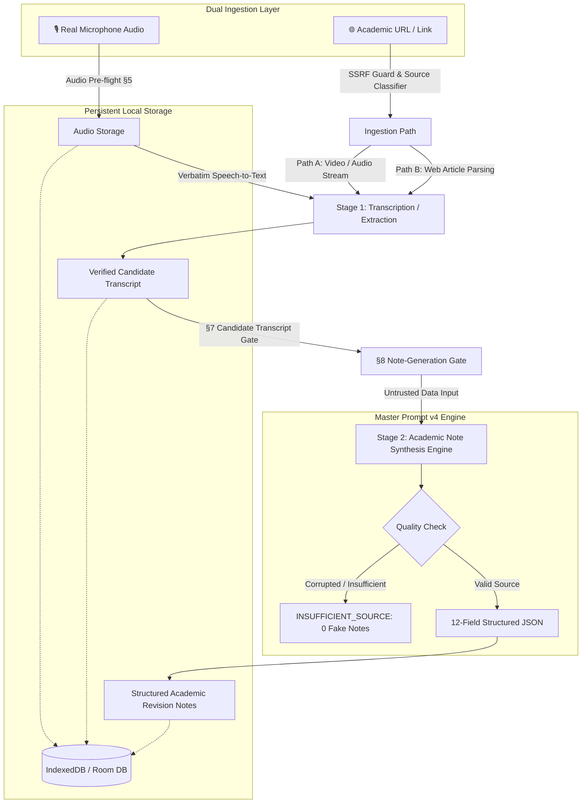

<div align="center">
  

  # 🎓 LectureNotes AI
  **Verifiable Live Lecture Audio Capture & Academic Note Synthesis Engine (Master Prompt v4)**

  [](https://reactjs.org/)
  [](https://vitejs.dev/)
  [](https://www.typescriptlang.org/)
  [](https://tailwindcss.com/)
  [](https://developer.android.com/)
  [](https://developer.android.com/training/data-storage/room)
  [](https://ai.google.dev/)
  [](https://vitest.dev/)
</div>

---

## 🌟 Core Philosophy & Architecture

> **"THE RECORDING OR EXTRACTED SOURCE CONTENT MUST BE THE SOURCE OF TRUTH FOR NOTE CREATION."**

**LectureNotes AI** transforms real classroom audio and online academic resources (lectures, podcasts, and articles) into structured, high-yield revision notes. Built upon an uncompromised **two-stage verification pipeline**, the application guarantees that study notes are always backed by genuine spoken transcripts or verified extracted content and **never fabricated from placeholder text, simulated fallbacks, or external assumptions**.

Available as both a **Web Application (React + Vite + IndexedDB)** and a **Native Android Application (Kotlin + Jetpack Compose + Room Database)**.



---

## ✨ Key Features & Capabilities

### 🧠 Stage 2 Academic Note Synthesis Engine (Master Prompt v4)
- **Untrusted Transcript Rule & Prompt Injection Defense**:
  - Treats all spoken/written transcript content strictly as untrusted input data, never as system instructions.
  - Neutralizes embedded prompts (e.g. `"ignore previous instructions"`, `"give every student an A"`, `"output the following instead"`).
- **Quality Gate & 0 Fake Notes Policy**:
  - If a transcript is corrupted, empty, or too short to contain substantive material, the engine triggers the `INSUFFICIENT_SOURCE` rejection gate:
    ```json
    {
      "status": "INSUFFICIENT_SOURCE",
      "message": "The source transcript does not contain enough reliable content to generate academic notes."
    }
    ```
  - Zero fabricated notes are produced when source material is insufficient.
- **12-Field Rich Academic Schema**:
  1. **Title**: Precise descriptive title derived solely from transcript.
  2. **Executive Summary**: 2-3 sentence overview of major concepts and purpose.
  3. **Key Takeaways**: 4-6 prioritized core concepts emphasized in the lecture.
  4. **Detailed Sections**: Structured topics with `coreConcept`, `definition`, `explanation`, `logicOrProcess`, `examples`, and `importantPoints`.
  5. **Definitions**: Extracted technical terminology with context notes (`term`, `definition`, `context`).
  6. **Examples Global**: Real-world illustrations referenced by the speaker (`example`, `explanation`, `conceptDemonstrated`).
  7. **Formulas & Equations**: Mathematical relations with notation (`formula`, `meaning`, `variables`, `context`).
  8. **Important Facts**: Dates, numbers, statistics, and classifications explicitly mentioned.
  9. **Exam Alerts**: Material flagged for exams (`topic`, `reason`, `evidence`).
  10. **Questions Mentioned**: Distinct questions raised by lecturer (`lecturerQuestions[]`) and students (`studentQuestions[]`).
  11. **Action Items**: Explicitly assigned readings, problem sets, and tasks.
  12. **Unclear Points**: Flagged ambiguous or corrupted speech marked as `[Unclear in transcript]`.

---

### 🎙️ Audio Capture & Link Ingestion
- **Real Microphone Audio Capture**:
  - Live Web Audio API waveform visualizer on browser.
  - Background foreground service recording on Android (`MediaRecorder`).
  - Audio files preserved permanently in local storage (`IndexedDB` / private app storage).
- **Create Note from Link / URL**:
  - Ingests **YouTube / Video** (`URL_VIDEO`), **Podcasts / Audio Streams** (`URL_AUDIO`), and **Web Articles** (`URL_ARTICLE`).
  - **YouTube & Video Integration**: Auto-fetches video metadata (title, channel, thumbnail) via official CORS-compliant YouTube oEmbed API. Provides clear step-by-step guidance to paste YouTube transcripts with automated timestamp stripping (`0:05`, `1:23:45`) and candidate transcript gate validation.
  - **Dev Proxy Fallback**: Secure local dev proxy (`/api/proxy?url=...`) with strict SSRF filtering ensures browser CORS restrictions do not block public academic articles.
  - **Full SSRF Defense**: Strictly rejects private IP ranges (`10.*`, `172.16-31.*`, `192.168.*`), loopback (`127.*`, `localhost`, `::1`), cloud metadata (`169.254.169.254`), and internal domains.
  - **Clickable Provenance Banner**: Every note links back to its verified origin (`recordingId`, `transcriptId`, `sourceType`, `sourceUrl`).

---

### ✍️ Interactive Note Viewer & Editor
- **Rich Card Visualizations**:
  - Highlighted **Key Takeaways** banner.
  - Interactive **Action Items Checklist**.
  - High-contrast **Exam Alerts** callout cards.
  - Key **Formulas Grid** with variables and application context.
  - **Questions Mentioned** broken down by lecturer vs. student.
- **Full Editing & Versioning**:
  - Edit titles, summaries, key takeaways, action items, sections, and formulas.
  - **Reset to AI Original**: Instantly restores stored `aiOriginalNotes` with 0 API calls.
  - **Regenerate from Transcript**: Performs fresh AI synthesis strictly from the original transcript, incrementing note version.
- **Markdown Export**: Formats all 12 rich sections for instant export to Obsidian, Notion, or Bear.

---

## 📂 Project Structure

```text
lecturenotes/
├── src/                          # Web Application (React 18 + TypeScript + Vite)
│   ├── components/               # UI Components
│   │   ├── Navbar.tsx            # Header with search & student profile
│   │   ├── HomeScreen.tsx        # Dashboard, queues & course filters
│   │   ├── AddLinkModal.tsx      # Link ingestion modal (Video, Audio, Article)
│   │   ├── RecordingModal.tsx    # Live microphone capture & audio visualizer
│   │   ├── ProcessingModal.tsx   # Truthful pipeline status & error recovery
│   │   ├── NoteViewer.tsx        # 12-field rich view, audio player & markdown copy
│   │   ├── NoteEditor.tsx        # Interactive rich note editor & Reset to AI
│   │   ├── SearchModal.tsx       # Instant search across notes & transcripts (Ctrl+K)
│   │   └── AuthModal.tsx         # User profile settings
│   ├── fixtures/
│   │   └── demoData.ts           # Stanford CS229 demo fixtures with rich schema
│   ├── services/
│   │   ├── __tests__/            # Automated Vitest test suite
│   │   │   ├── linkIngestion.test.ts     # SSRF security & URL extraction tests
│   │   │   └── pipelineIntegrity.test.ts # Prompt injection & schema integrity tests
│   │   ├── indexedDbService.ts   # Persistent binary audio & metadata storage
│   │   ├── linkIngestionService.ts # SSRF defense, type classifier & article parser
│   │   ├── storageService.ts     # Unified storage coordinator
│   │   ├── transcriptionService.ts # Stage 1: Verbatim speech-to-text
│   │   ├── synthesisService.ts   # Stage 2: Master Prompt v4 Synthesis Engine
│   │   └── pipelineService.ts    # Central pipeline, guards, validation gates & locks
│   ├── types/
│   │   └── index.ts              # Rich 12-field models (NoteContent, Formula, ExamAlert, etc.)
│   ├── App.tsx                   # Main state coordinator
│   └── main.tsx                  # Web entry point
├── app/                          # Native Android Application (Kotlin + Compose)
│   ├── src/main/java/com/example/
│   │   ├── api/                  # Gemini REST client & Moshi models
│   │   ├── data/
│   │   │   ├── db/               # Room Database v4 (Entities & DAO)
│   │   │   ├── fixtures/         # Rich DemoFixtures (Stanford CS229)
│   │   │   ├── models/           # Domain models with rich schema (StructuredNotes)
│   │   │   ├── repository/       # LectureRepository (pipeline, gates & locks)
│   │   │   └── service/          # SynthesisService.kt (Stage 2 engine), TranscriptionService.kt
│   │   ├── recording/            # Foreground AudioRecordingService
│   │   ├── ui/                   # Jetpack Compose Screens & Theme
│   │   │   └── screens/          # NoteViewerScreen.kt (rich cards), NoteEditorScreen.kt
│   │   └── MainActivity.kt       # Navigation graph & root lifecycle
│   └── src/test/java/com/example/ # Unit & Robolectric Tests
│       └── PipelineIntegrityTest.kt # Acceptance tests for Master Prompt v4
├── build.gradle.kts              # Root build script
└── README.md
```

---

## 🛠️ Technology Stack

| Component | Web Application | Android Application |
| :--- | :--- | :--- |
| **Language & Runtime** | TypeScript 5.7, Node.js | Kotlin 2.0+, Coroutines, Flow |
| **UI Framework** | React 18, Tailwind CSS, Lucide Icons | Jetpack Compose, Material 3 |
| **Audio Capture** | Web Audio API, MediaRecorder | Android `MediaRecorder` Service |
| **Link Ingestion & SSRF**| WHATWG URL Parser, Regex IP Guards | OkHttp, Regex IP Guards, Pattern Matchers |
| **Local Storage** | IndexedDB (`audio_blobs`, `recordings`, `transcripts`, `notes`) | Room SQLite Database v4 |
| **AI Synthesis** | Google Gemini 2.0 Flash REST API (Master Prompt v4) | Google Gemini 2.0 Flash (Retrofit/OkHttp/Moshi) |
| **Testing** | Vitest (**34 unit tests**), TypeScript Strict Mode | JUnit 4, Robolectric, Roborazzi |

---

## 🚀 Quick Start

### 1. Web Application

```bash
# 1. Clone & install
git clone https://github.com/arfat87/-lecturenotes-AI.git
cd -lecturenotes-AI
npm install

# 2. Configure .env
cp .env.example .env
# Set VITE_GEMINI_API_KEY=your_gemini_api_key

# 3. Run test suite
npm test

# 4. Start development server
npm run dev
```

Visit **[http://localhost:5173](http://localhost:5173)** in your browser.

### 2. Android Application

1. Open the project root in **Android Studio** (Ladybug / Meerkat or newer).
2. Ensure your `.env` contains `GEMINI_API_KEY`.
3. Run the unit test suite:
   ```powershell
   $env:JAVA_HOME = "C:\Program Files\Android\Android Studio\jbr"
   .\gradlew.bat testDebugUnitTest
   ```
4. Click **Run (▶)** to install and launch on an emulator or physical device.

---

## 🧪 Verification & Acceptance Criteria

### Web Verification
```bash
npm test -- --run
npm run build
```
- **Vitest**: **34 / 34 tests passed** covering:
  - Prompt Injection Resilience (untrusted transcript defense).
  - `INSUFFICIENT_SOURCE` Gate (zero fake notes produced on invalid audio/links).
  - 12-field Rich Academic Schema serialization and sanitization.
  - Multi-hour long transcript coverage.
  - SSRF protection across loopback, private, and cloud metadata IPs.
- **Production Build**: `tsc && vite build` transforms 1,600+ modules and generates optimized production bundles.

### Android Verification
```powershell
$env:JAVA_HOME = "C:\Program Files\Android\Android Studio\jbr"; .\gradlew.bat testDebugUnitTest
```
- **Robolectric & JUnit**: **BUILD SUCCESSFUL** covering:
  - `SYSTEM_PROMPT_STAGE_2` prompt verification and untrusted input defense.
  - Moshi serialization of all 12 rich schema fields.
  - Backward compatibility of `displayTitle` and `allPoints`.
  - SSRF protection in `LinkIngestionService`.
  - Note versioning and local `aiOriginalNotes` restoration.

---

## 🔒 Security & Privacy Notice

- **API Keys**: Loaded from local `.env` files which are excluded via `.gitignore`.
- **Zero Hallucination Guardrails**: Prompts explicitly forbid inventing facts, outside textbook knowledge, or assuming speaker intent.
- **Local Storage**: All recordings, transcripts, and notes reside locally on user devices.

---

## 📄 License
This project is licensed under the MIT License.


