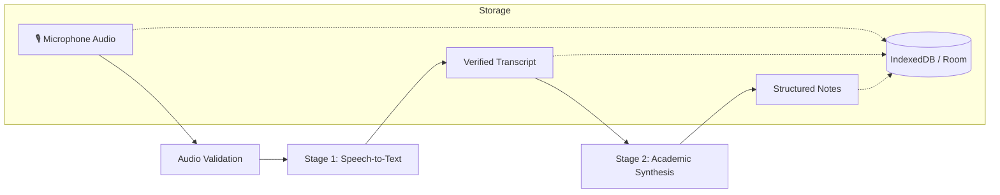

<div align="center">
  

  # 🎓 LectureNotes AI
  **Verifiable Live Lecture Audio Capture & Structured Academic Notes Synthesizer**

  [](https://reactjs.org/)
  [](https://vitejs.dev/)
  [](https://www.typescriptlang.org/)
  [](https://tailwindcss.com/)
  [](https://developer.android.com/)
  [](https://developer.android.com/training/data-storage/room)
  [](https://ai.google.dev/)
</div>

---

## 🌟 Core Philosophy & Architecture

> **"THE RECORDING MUST BE THE SOURCE OF TRUTH FOR NOTE CREATION."**

**LectureNotes AI** transforms real classroom audio into structured, high-yield study notes. Built upon a strict **two-stage verification pipeline**, the application guarantees that study notes are always backed by genuine spoken audio transcripts and never fabricated from placeholder text or simulated fallbacks.

Available as both a **Web Application (React + Vite + IndexedDB)** and a **Native Android Application (Kotlin + Jetpack Compose + Room Database)**.



---

## ✨ Key Features

- 🎙️ **Real Microphone Audio Capture**:
  - Web Audio API waveform visualizer on browser.
  - Background foreground service recording on Android (`MediaRecorder`).
  - Audio files are stored permanently in local storage (IndexedDB `audio_blobs` store / Android app private storage).
- 🔄 **Strict 2-Stage Recording-to-Note Pipeline**:
  - **Stage 1 (Transcription)**: Faithful verbatim speech-to-text with Gemini 2.0 Flash (`text/plain` streaming).
  - **Stage 2 (Synthesis)**: Academic note extraction strictly from the verified transcript into structured JSON.
- 🚫 **Zero Fake Fallbacks**:
  - No synthetic sample generators in production.
  - If processing fails or audio is silent, the original audio is safely preserved and explicit retry actions are provided without requiring re-recording.
- 🔊 **Audio Provenance & Playback**:
  - Notes explicitly reference their `recordingId` and `transcriptId`.
  - Built-in audio player in Note Viewer enables instant listening of original lecture audio.
- 🧪 **Isolated Demo Fixtures**:
  - Pre-seeded Stanford CS229 sample lectures are explicitly tagged with `isDemo: true` and isolated from user recordings.
- ⚡ **Structured Study Insights**:
  - **Executive Summaries**: High-level synthesis of lecture goals.
  - **Topic Concept Breakdowns**: Logical grouping with clear bullet points.
  - **Key Definitions & Context**: Technical terms explained with context notes (💡).
  - **Exam Alerts**: Midterm and final exam callouts flagged automatically (⚡).
- ✍️ **Interactive Note Editor**: Edit topics, points, definitions, and exam flags, with 1-click **Reset to AI Original**.
- 🔍 **Full-Text Search & Filtering**: Real-time querying across notes, definitions, transcripts, and exam alerts (`Ctrl + K` / `Cmd + K`).
- 📝 **Markdown Export**: One-click markdown copy formatted for Obsidian, Notion, or Bear.

---

## 🚀 Quick Start (Web Application)

### Prerequisites
- [Node.js](https://nodejs.org/) (v18 or newer)
- npm or pnpm / yarn

### 1. Configure Environment
Create a `.env` file in the project root:
```env
GEMINI_API_KEY=your_gemini_api_key_here
VITE_GEMINI_API_KEY=your_gemini_api_key_here
```

### 2. Install & Run
```bash
# Install dependencies
npm install

# Start development server
npm run dev

# Build for production
npm run build
```
Open **[http://localhost:5173](http://localhost:5173)** in your browser.

---

## 📱 Quick Start (Android Application)

### Prerequisites
- [Android Studio](https://developer.android.com/studio) (Ladybug / Meerkat or newer)
- JDK 17 or JDK 21 (e.g. Android Studio embedded JBR)
- Android device or emulator (API level 24+)

### Steps:
1. Open the project root in **Android Studio**.
2. Ensure your `.env` file contains `GEMINI_API_KEY`.
3. Allow Gradle to synchronize dependencies.
4. Run unit tests:
   ```powershell
   .\gradlew.bat testDebugUnitTest
   ```
5. Click **Run (▶)** to install and launch on your device/emulator.

---

## 📂 Project Structure

```text
lecturenotes/
├── src/                          # Web Application (React 18 + TypeScript)
│   ├── components/               # UI Components
│   │   ├── Navbar.tsx            # Header with search & student profile
│   │   ├── HomeScreen.tsx        # Dashboard, audio queues & course filter chips
│   │   ├── RecordingModal.tsx    # Live microphone capture & audio visualizer
│   │   ├── ProcessingModal.tsx   # 3-step truthful pipeline status & retry
│   │   ├── NoteViewer.tsx        # Note view, audio playback & provenance badge
│   │   ├── NoteEditor.tsx        # Topic, definition & exam flag editor
│   │   ├── SearchModal.tsx       # Instant search across notes & transcripts (Ctrl+K)
│   │   └── AuthModal.tsx         # User profile settings
│   ├── fixtures/
│   │   └── demoData.ts           # Isolated Stanford CS229 demo fixtures (isDemo: true)
│   ├── services/
│   │   ├── indexedDbService.ts   # Persistent binary audio & metadata storage
│   │   ├── storageService.ts     # Unified storage coordinator
│   │   ├── transcriptionService.ts # Stage 1: Verbatim speech-to-text
│   │   ├── synthesisService.ts   # Stage 2: Academic note synthesis
│   │   ├── pipelineService.ts    # Central 13-step pipeline & concurrency lock
│   │   └── geminiService.ts      # Gemini client facade
│   ├── types/
│   │   └── index.ts              # Relational models (Recording, Transcript, Note)
│   ├── App.tsx                   # Main state coordinator
│   └── main.tsx                  # Web entry point
├── app/                          # Native Android Application (Kotlin + Compose)
│   ├── src/main/java/com/example/
│   │   ├── api/                  # Gemini REST client & Moshi models
│   │   ├── data/
│   │   │   ├── db/               # Room Database v2 (RecordingEntity, TranscriptEntity, NoteEntity, DAO)
│   │   │   ├── fixtures/         # Isolated Android DemoFixtures (isDemo = true)
│   │   │   ├── models/           # Relational domain models
│   │   │   ├── repository/       # LectureRepository (2-stage pipeline & job locks)
│   │   │   └── service/          # TranscriptionService.kt & SynthesisService.kt
│   │   ├── recording/            # Foreground AudioRecordingService
│   │   ├── ui/                   # Jetpack Compose Screens & Theme
│   │   └── MainActivity.kt       # Navigation graph & root lifecycle
│   └── src/test/java/com/example/ # Unit & Screenshot Tests
│       ├── ExampleUnitTest.kt
│       ├── ExampleRobolectricTest.kt
│       ├── GreetingScreenshotTest.kt
│       └── PipelineIntegrityTest.kt # Pipeline & Provenance validation tests
├── build.gradle.kts              # Root build script
└── README.md
```

---

## 🛠️ Technology Stack

| Component | Web Application | Android Application |
| :--- | :--- | :--- |
| **Language & Runtime** | TypeScript 5.7, Node.js | Kotlin 2.0+, Coroutines, Flow |
| **UI Framework** | React 18, Tailwind CSS, Lucide Icons | Jetpack Compose, Material 3 |
| **Audio Capture** | Web Audio API, MediaRecorder | Android `MediaRecorder` Service |
| **Local Storage** | IndexedDB (4 Object Stores) | Room SQLite Database v2 |
| **AI Synthesis** | Google Gemini 2.0 Flash REST API | Google Gemini 2.0 Flash (Retrofit/OkHttp/Moshi) |
| **Testing** | TypeScript Strict Type Checking | JUnit 4, Robolectric, Roborazzi |

---

## 🧪 Verification & Testing

- **Web Verification**:
  ```bash
  npm run build
  ```
  *(Checks TypeScript types and creates optimized Vite production bundle with 0 errors)*

- **Android Verification**:
  ```powershell
  .\gradlew.bat testDebugUnitTest
  ```
  *(Executes all unit tests, Robolectric tests, and pipeline integrity tests)*

---

## 📄 License
This project is licensed under the MIT License.

